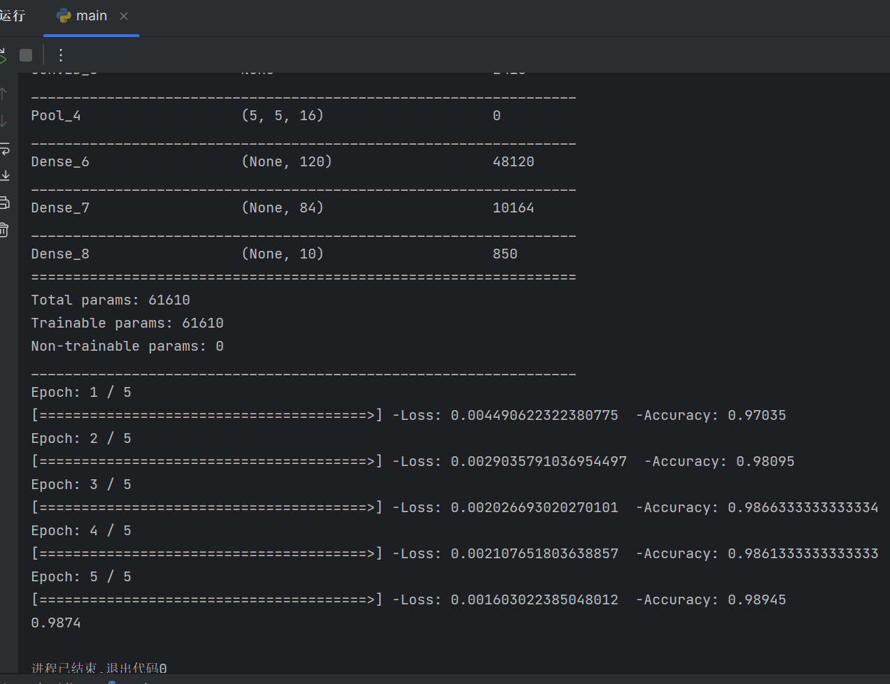

# A brief description of the achieved effect
A numpy-based deep learning framework (not including tensorflow, pytorch and other existing frameworks)

Just as written in main.py, the model
```python
model = Sequential()
model.add(Conv2D(6, (3, 3), padding='same', activation='relu', input_shape=(28, 28, 1)))
model.add(Pool((2, 2), method='average', strides=(2, 2), input_shape=(28, 28, 6)))
model.add(Conv2D(16, (5, 5), padding='valid', activation='relu', input_shape=(14, 14, 6)))
model.add(Pool((2, 2), method='max', strides=(2, 2), input_shape=(10, 10, 16)))
model.add(Flatten())
model.add(Dense(400, 120, activation='relu', input_shape=(5, 5, 16)))
model.add(Dense(120, 84, activation='relu', input_shape=(400, 1)))
model.add(Dense(84, 10, activation='softmax', input_shape=(84, 1)))
```
can perform pretty well in the MINIST set which proves that my code is capable of implementing basic deep learning functionality.

(This model only use 5 *epoches* and *learning_rate* of 0.1 without any optimizer and training.)


